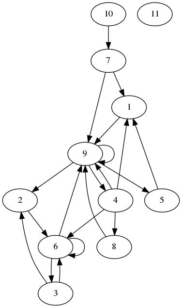

This is a collection of notes, and full of errors and half-understood falsehoods :-)

Overview
========

I wanted to use python to do graph queries, accelerated by a GPU. Turns out, this is not quite
as easy as expected. Several elements are required.

Before getting into any detail, there is one book I need to recommend:
["Python High Performance - Second Edition"]
(https://www.packtpub.com/application-development/python-high-performance-second-edition)

The book helped me a lot in getting an understanding of cython, pypy, numpy, pandas, numba and cuda.

Other then that, one needs to plug multiple elements together:

- Fast python - being aware of possible speedups
- Numpy - to store the data we want to process
- Numba.jit - to turn python into machine code, making things go faster
- CUDA - a basic understanding of how things work
- Numba.cuda - to use CUDA from python, without writing any C
- Parallel graph handling - turns out, this is the hard part.

It might make more sense from the bottom up: handling graphs on a GPU is not an easy job at all. One
needs to understand parallel algorithms to do that. Also the graph needs to be put into a suitable
data structure on the GPU. We can't use the beloved python dicts etc, all we have are
(multidimensional) arrays, with the values being of fixed type. Because we still use python, we
use numpy to create and handle the arrays. The interface between our python code running on the
CPU ('host') on the one side, and the GPU ('device') on the other is numba, or numba.cuda to be
precise. This allows us two things: getting the arrays full of data into the GPU and back, and
also writing "kernels" that run in parallel on the GPU and do the magic work. With the GPU being
fast, it also makes sense to speed up the host based (remember: CPU) code, and we can use numba.jit
for that. And of course it helps to speed up python wherever possible.

A short note on the use of CUDA: I am aware that opencl would be the open alternative to CUDA. For
that is a second step: there was quite a lot to learn, and so I went the seemingly easier path
and bought a GTX 1060 for the experiments.

I have put my example code on https://github.com/jhb/gpgpu. Most of the examples are from
https://github.com/jhb/gpgpu/blob/master/bfs4.py.

Before diving into the code some preliminaries to make sense of it all.

Numpy
=====

We need to numpy to load data from/to the GPU. This is done using numpy arrays, which have a fixed
datatype and a fixed shape (size). They can be multidimensional, e.g. 10x20 or whatever. I found
the fixed size to be quite annoying for the graph use case, but nothing we can do about it. But
to compensate, numpy does a lot of guesswork for us:

```python
import numpy as np
a = np.array([1,2,3]) # types are guessed
b = np.array([1,2,3], dtype= dtype=np.uint32) #explitit types
c = np.zeros(10) #10 zeros
d = np.empty(shape=(10,20)) # a two dimensional 10x20 array
```
We can create np arrays from existing data, or we create arrays first, and fill them up later.
https://docs.scipy.org/doc/numpy/user/quickstart.html#array-creation has a lot of info.

The important thing is to remember that the size is fixed. And that we can use most of numpy's
computational features only the on the host side.

numba
=====

[Numba](http://numba.pydata.org/numba-doc/latest/user/index.html) is fantastic tool for speeding
things up in python land. While other tools might use a C compiler to turn python into c, and
from there to machine code, numba uses llvm to go 'directly' from python to machine code. It works
it's magic mostly behind the scenes.

To install it follow it's install instructions, also for the cudatoolkit. It's the easiest way.

jit
---
Numba can accelerate functions by just decorating it with its 'jit' decorator. Nothing else
required, but still an immense speedup

From the example code:

```python
from numba import jit
#[...]
@jit(nopython=True)
def buildEdgelist(frontier, nodearray):
    edgelist = []
    for nodeid in frontier:
        offset, num = nodearray[nodeid]
        for n in range(num):
            edgelist.append(offset+n)
    return edgelist
```

The `nopython=True` just signals that it should not fall back to (slow) python code, and instead
throw an error.

I use jit to accelerate the parts of the code that I couldn't put onto the GPU (yet).

cuda
----

My mental image of CUDA is as follows:

- You typically split up your computational problem (e.g. traversing a graph, or simpler,
  doing lots of vector calculations) into isolated tasks, that could be run in parallel. You write
  a function to handle a task on the GPU which is called "kernel". That kernel is run by many
  threads. One task, one thread. The GPU will try to work as fast as possible through all tasks,
  doing also many tasks at the same time.
- Because the kernel (programm for the GPU)  is the same for all tasks/threads you can get a
  thread id from within the running kernel. This helps you to find out which data to work on.
- Threads can be logically grouped in 1,2 or 3 dimensional blocks, and you can get a matching
  thread id. E.g. if you have a 10x20 array, you might want to get a 2D thread id, telling where
  you are within the array
- The GPU still loves it when at least a group of 32 threads (a warp) do exactly the same thing.
  Hence try to avoid "if" and other branching into different code paths. Imagine a chorus line on
  broadway, everbody kicks their leg at the same time!
- But there is no guarantee on the task order at all. You just know, what thread you have. E.g.
  just because the thread id is higher doesn't mean the thread is handled or finished later!
- The kernels don't return data, they modify arrays that are provided as a parameter to the kernel.
- The memory for the Graphics card and the main computer memory are seperated. Data (in arrays,
  it's alwas arrays) can be transferred back and forth automatically by numba. But even though
  you don't manage it, it still needs quite some time to do this. If you have data that should
  stay on the GPU between different kernel runs, you can also manually transfer the arrays, and
  leave them on the GPU while you don't need them. This can save a lot of time!

Knowing that, using cuda becomes quite simple. Here are some lines from the example, this time
I left out some bits, for clarity:

```python
from numba import cuda

@cuda.jit # the decorator creates the kernel.
def workEdges(edgelist,edgearray,unknown,targetlist):
    pos = cuda.grid(1)
    if pos<edgelist.size:
        source,target = edgearray[edgelist[pos]]
        targetlist[pos]=unknown[target]*target # here I avoid an "if" statement
        unknown[target] = 0

# preparing data
nodearray = np.array(nodes, dtype=np.uint32)
edgearray = np.array(edges, dtype=np.uint32)
unknown = np.ones(len(nodes))
targetlist = np.empty(len(edgelist),dtype=np.uint32)

# manually transferring it to the GPU
dnodearray = cuda.to_device(nodearray)
dedgearray = cuda.to_device(edgearray)
dunknown = cuda.to_device(unknown)
dtargetlist = cuda.to_device(targetlist)

# grouping the tasks
threadsperblock = 32
blockspergrid = (len(edgelist) + (threadsperblock - 1)) // threadsperblock

# The actual kernel invocation. This once call will run the kernel on all tasks
# dtargetlist is the where the output gets stored, all other are input arrays in this
# example
workEdges[blockspergrid, threadsperblock](dedgelist,dedgearray,dunknown,dtargetlist)
```

Graph application
=================

I really wanted to have an example of an algorithm running on a graph. This is not as easy as
thought.

First you need a suitable structure to store your graphs. There are different ways to do that. Look
at e.g.
https://www.khanacademy.org/computing/computer-science/algorithms/graph-representation/a/representing-graphs.

Also, remember how I tried to stress that our arrays are of fixed size? This is going to bite
us where it hurts. Also, remember that the kernels run partially in parallel, but in an unpredicted
way? Because there is not python (with it's GIL in the background) we don't have (automatic) atomic
writes. So threads better write to different array cells (unless you are happy with overwriting each
other) or don't read from each other's result cells.

Now, imagine we want to walk a graph in parallel. Nodes can have no, one or many outgoing edges.
Edges from different nodes might point to the same node. This means it's quite hard to predict how
many edges or nodes are encountered at each step of the algorithm. Remember, you are on a GPU, you
want to do things in parallel. And not use a kernel with a single thread to quickly count through
all nodes or edges. That would be like a soloist on the broadway stage doing her thing, while
hundreds of dancers stand in the background, being bored to death!

This means even simple things become complicated:

1. calculating a sum of all elements in an array (check cuda.reduce for a solution)
2. filtering an array for certain elements. E.g. turning [1,2,0,3,0,4] into [1,2,3,4].
  "Stream compaction" is a good keyword for further investigation.

Because I haven't found a solution for two, I am shifting arrays back and forth, and do some of the
work on the host. Well, work in progress.

Putting it together
===================

In bfs4.py I do a simple breadth-first-search on a graph. Let's look at an example graph:



I want to start at node 1, and search all nodes that I can reach from there, only going forward.
The algorithm does this in parallel, so it reaches the following nodes. We don't go to nodes we
already know.

```
[1]
[9]
[2,4,5]
[6,8]
[3]
```

So, how is this done? The graph is stored in an edge and a node array. The edge array stores
each edge in the form [source,target]. From the [edges_10.txt](edges_10.txt) file:

```
1 9
2 6
3 2
3 6
4 1
4 6
4 8
4 9
5 1
6 3
6 6
6 9
7 1
7 9
8 9
9 2
9 4
9 5
9 9
10 7
```

Each line is an edge, the line number is the edgeid. E.g. edge number one in line number 1 contains
the edge from 1 to 9.

The nodes live in [edges_10.txt](edges_10.txt). Here we assume the first line has number 0, so
node 1 really is in line 2. Each line stores information about the edges going from this node:

```
0 0
0 1
1 1
2 2
4 4
8 1
9 3
12 2
14 1
15 4
19 1
```

The first number is the offset in the edges file, the second number describes the number of edges.
E.g the edges node 1 (in line 2) begin at the top (0), and there is one edge.

The complete is in https://github.com/jhb/gpgpu/blob/master/bfs4.py, please try for yourself.

Further research
================

First, I need to understand the basic building blocks like reduce or stream compaction. Then I
really would like to implement a far more interesting algorithm that is described by Simon
Evertsson in his thesis ["Accelerating graph isomorphism queries in a graph database using
the GPU"](https://uu.diva-portal.org/smash/get/diva2:1056415/FULLTEXT01.pdf). His code repository
is here: https://github.com/SimonEvertsson/neo4j-gpu.


